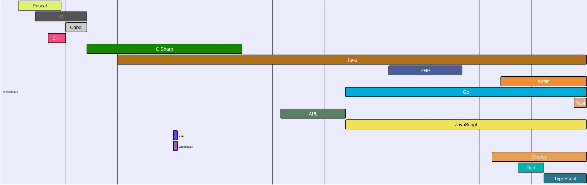

# skillstream.dev

Render a timeline of your skills during your lifetime as a developer.

The code is still not here 'cause I'm cleaning it up a bit otherwise it won't be possible for people to contribute if anyone wants to (it really sucks right now).

So this repository, at the moment, is just a placeholder, but please **do open issues if you find something wrong, want to add a new skill, etc.**

I plan to put the code here very soon, however it was already find time to create the website, so expect a little bit of delay to publish the code (it's very simple though).

## Related Article

I plan to very soon write an article about the process of creation of this website.